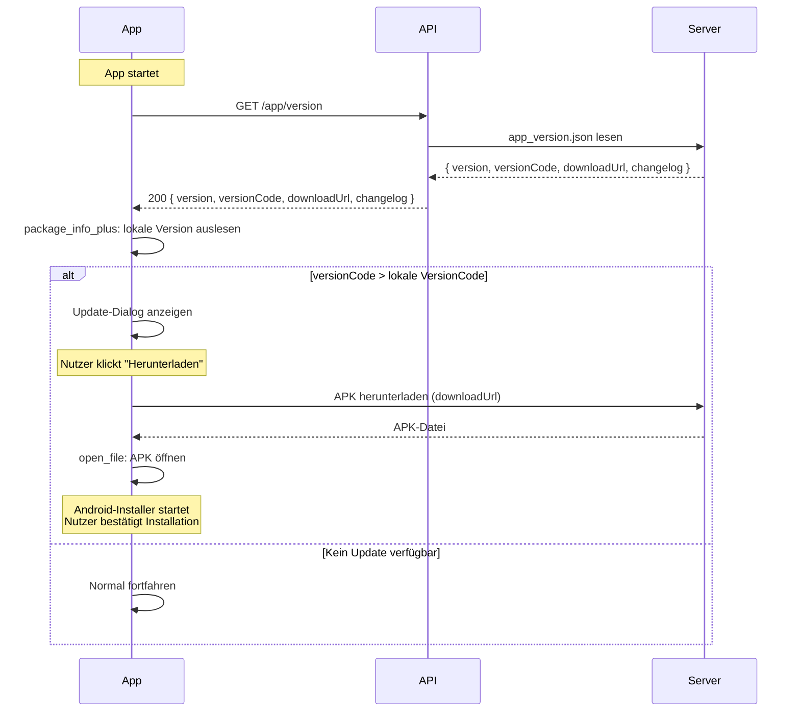

# App-Version & Updates

Die API bietet einen öffentlichen Endpoint, um die aktuelle App-Version abzurufen.
Die Android-App nutzt diesen Endpoint, um bei jedem Start zu prüfen, ob ein Update verfügbar ist.

## Update-Flow



## Endpoint

| Methode | Pfad | Auth | Beschreibung |
|---------|------|------|-------------|
| `GET` | `/api/v2/app/version` | Keine | Aktuelle Version abfragen |

### GET /api/v2/app/version

Gibt die aktuell auf dem Server verfügbare App-Version zurück.
Dieser Endpoint ist öffentlich zugänglich und erfordert keine Authentifizierung.

**Response (200):**
```json
{
    "version": "0.5.0",
    "versionCode": 5,
    "downloadUrl": "https://sinclear.de/downloads/sinclear-v0.5.0.apk",
    "changelog": [
        "Erste öffentliche Version"
    ]
}
```

**Fehler:** `503 version_info_unavailable`, `503 version_info_invalid`

## Versionsverwaltung

### Datei: `app_version.json`

Die Versionsinformationen werden in `app_version.json` im API-Root gespeichert:

```json
{
    "version": "0.5.0",
    "versionCode": 5,
    "apkFile": "sinclear-v0.5.0.apk",
    "changelog": [
        "Erste öffentliche Version"
    ]
}
```

### Deployment-Checkliste

Für jedes Release:

1. **`pubspec.yaml` aktualisieren:**
   ```yaml
   version: 0.6.0  # versionName
   ```
   Der `versionCode` wird automatisch hochgezählt (bei jedem `flutter build`).

2. **`app_version.json` aktualisieren:**
   ```json
   {
       "version": "0.6.0",
       "versionCode": 6,
       "apkFile": "sinclear-v0.6.0.apk",
       "changelog": [
           "Neue Funktion X",
           "Bugfixes"
       ]
   }
   ```

3. **APK hochladen:**
   - `flutter build apk --release`
   - APK in `/public_html/downloads/` hochladen
   - Dateiname: `sinclear-v0.6.0.apk`

4. **API deployen:**
   - Geänderte Dateien via FTP hochladen

### Datei: `downloads/` Verzeichnis

APK-Dateien werden im `downloads/`-Verzeichnis auf dem Webserver gespeichert:

```
/public_html/downloads/
  sinclear-v0.5.0.apk
  sinclear-v0.6.0.apk
```

Die `downloadUrl` in `app_version.json` zeigt auf die neueste APK.

## Sicherheit

- Der `/app/version`-Endpoint ist **öffentlich** zugänglich (keine Authentifizierung erforderlich)
- Die `app_version.json`-Datei ist über die `.htaccess` für externe Zugriffe geschützt, aber über den PHP-Endpoint erreichbar
- APK-Dateien im `downloads/`-Verzeichnis sind öffentlich downloadbar

## Client-Implementierung

Die Flutter-App nutzt `package_info_plus`, um die lokale Version zu ermitteln:

```dart
final packageInfo = await PackageInfo.fromPlatform();
final currentVersionCode = int.parse(packageInfo.buildNumber);
```

Der `versionCode` in `pubspec.yaml` wird bei jedem Release manuell hochgezählt und muss größer sein als der `versionCode` der installierten App.
