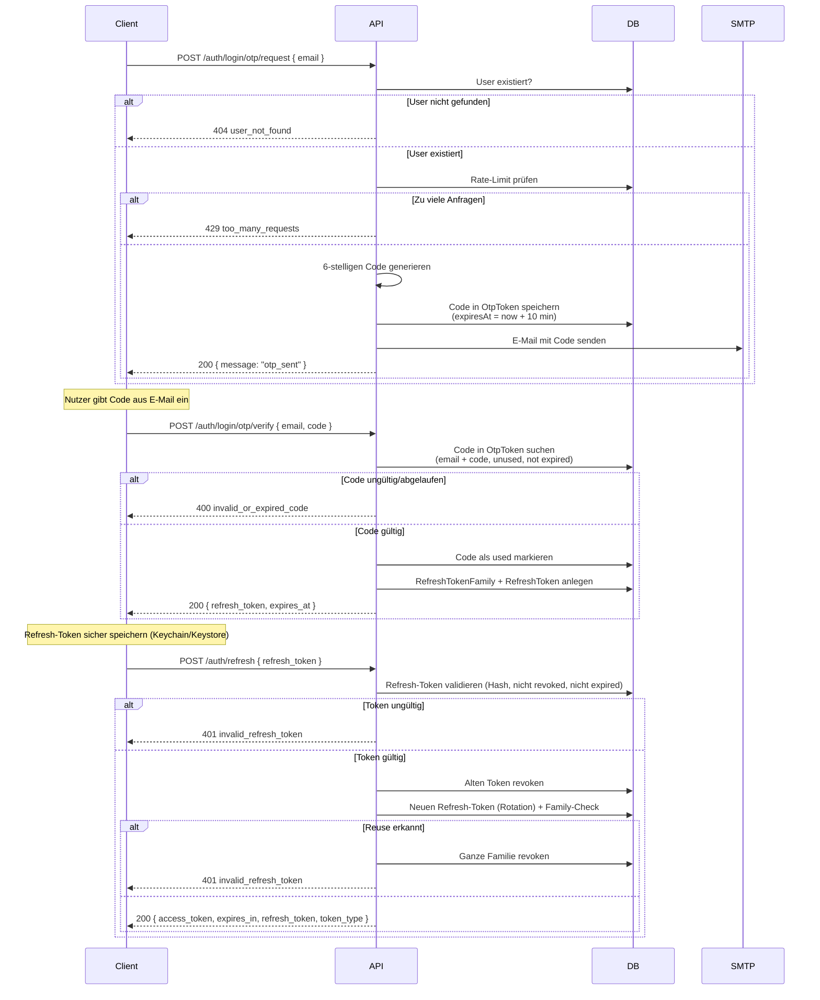
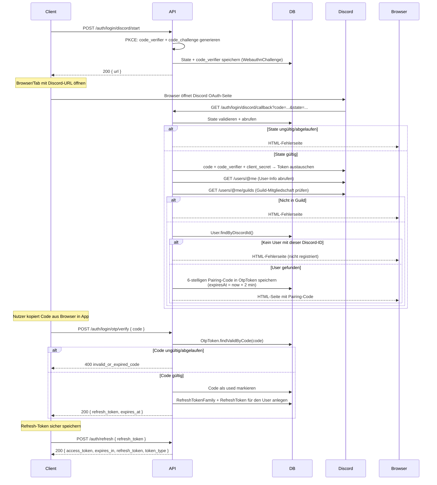
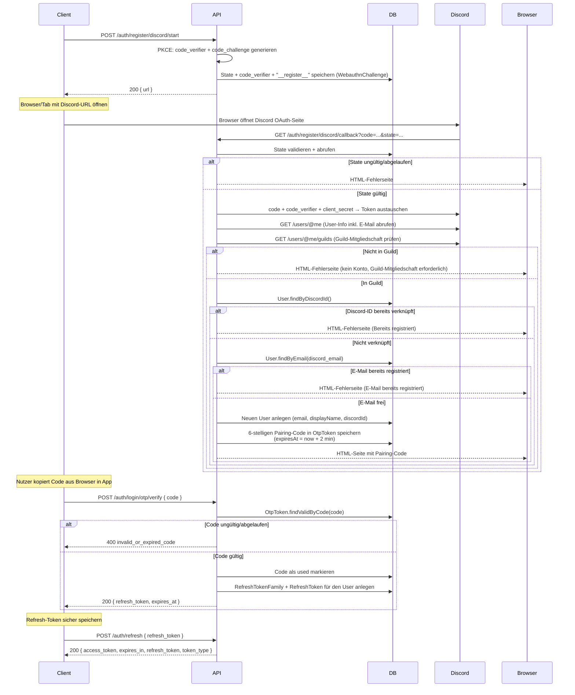

# Authentifizierung & Login

Die API v2 verwendet ein **token-basiertes Authentifizierungssystem** ohne Passwörter.
Unterstützt werden zwei Verfahren:

- **E-Mail OTP** – Einmaliger 6-stelliger Zahlencode per E-Mail
- **Discord OAuth2** – Anmeldung via Discord mit Guild-Prüfung + Pairing-Code

Für die **Registrierung** neuer Konten wird ebenfalls Discord OAuth2 verwendet (siehe unten).

## Token-Typen

| Token | Gültigkeit | Zweck |
|-------|-----------|-------|
| **Access-Token** (JWT) | 15 Minuten | Authentifiziert API-Anfragen (Bearer Token) |
| **Refresh-Token** | 90 Tage | Ausstellung neuer Access-Tokens (Rotation) |

Jeder Refresh-Token gehört zu einer **Familie**. Wird ein bereits rotierter Token
erneut verwendet, wird die gesamte Familie widerrufen (Reuse-Detection).

## E-Mail OTP Flow



## Discord OAuth2 Flow



## Discord OAuth2 Registrierungs-Flow



## API-Endpunkte

| Methode | Pfad | Rate-Limit | Beschreibung |
|---------|------|-----------|-------------|
| `POST` | `/api/v2/auth/login/otp/request` | 10 req/60s | E-Mail-OTP anfordern |
| `POST` | `/api/v2/auth/login/otp/verify` | 10 req/60s | Code verifizieren (OTP + Discord) |
| `POST` | `/api/v2/auth/login/discord/start` | – | Discord OAuth-URL generieren (Login) |
| `GET` | `/api/v2/auth/login/discord/callback` | – | Discord-Redirect verarbeiten (Login) |
| `POST` | `/api/v2/auth/register/discord/start` | – | Discord OAuth-URL generieren (Registrierung) |
| `GET` | `/api/v2/auth/register/discord/callback` | – | Discord-Redirect verarbeiten (Registrierung) |
| `POST` | `/api/v2/auth/refresh` | 10 req/60s | Access-Token erneuern |

### POST /api/v2/auth/login/otp/request

**Request:**
```json
{ "email": "user@example.com" }
```

**Response (200):**
```json
{ "message": "otp_sent" }
```

**Fehler:** `400 invalid_email`, `404 user_not_found`, `429 too_many_requests`

### POST /api/v2/auth/login/otp/verify

**Request (E-Mail-OTP):**
```json
{ "email": "user@example.com", "code": "482731" }
```

**Request (Discord-Pairing):**
```json
{ "code": "482731" }
```

**Response (200):**
```json
{
    "refresh_token": "a1b2c3d4e5f6...",
    "expires_at": 1747353600
}
```

**Fehler:** `400 invalid_code`, `400 invalid_or_expired_code`, `404 user_not_found`

### POST /api/v2/auth/login/discord/start

**Response (200):**
```json
{
    "url": "https://discord.com/api/oauth2/authorize?response_type=code&client_id=..."
}
```

### GET /api/v2/auth/login/discord/callback

**Query-Parameter:** `?code=...&state=...`

**Response (200):** HTML-Seite mit 6-stelligem Pairing-Code.
Der Nutzer kopiert diesen Code in die App und verwendet ihn an `/auth/login/otp/verify`.

### POST /api/v2/auth/register/discord/start

**Response (200):**
```json
{
    "url": "https://discord.com/api/oauth2/authorize?response_type=code&client_id=..."
}
```

### GET /api/v2/auth/register/discord/callback

**Query-Parameter:** `?code=...&state=...`

**Response (200):** HTML-Seite mit 6-stelligem Pairing-Code.
Der Nutzer kopiert diesen Code in die App und verwendet ihn an `/auth/login/otp/verify`.

**Fehler:** `Ungültiger State`, `Discord-Account bereits verknüpft`, `E-Mail bereits registriert`, `Guild-Mitgliedschaft fehlt`

### POST /api/v2/auth/refresh

**Request:**
```json
{ "refresh_token": "a1b2c3d4e5f6..." }
```

**Response (200):**
```json
{
    "access_token": "eyJhbGciOiJSUzI1NiIsInR5...",
    "expires_in": 900,
    "refresh_token": "x7y8z9...",
    "token_type": "Bearer"
}
```

**Fehler:** `400 missing_refresh_token`, `401 invalid_refresh_token`, `404 user_not_found`

## Sicherheitsmechanismen

| Mechanismus | Beschreibung |
|-------------|-------------|
| **HTTPS erforderlich** | Nicht-TLS-Verbindungen werden mit 403 abgewiesen |
| **Rate-Limiting** | 100 req/60s global, 10 req/60s auf Auth-Endpunkten |
| **OTP-Einschränkung** | Max. 3 Code-Anfragen pro E-Mail pro 60 Sekunden |
| **Code-Gültigkeit** | E-Mail-OTP: 10 Min, Discord-Pairing: 2 Min (einmalig) |
| **Refresh-Rotation** | Jeder Refresh wird rotiert; alte Tokens werden ungültig |
| **Reuse-Detection** | Bei Wiederverwendung eines alten Refresh-Tokens → gesamte Familie gesperrt |
| **Discord PKCE** | code_verifier + state verhindern CSRF/Callback-Faking |
| **Guild-Prüfung** | Nur Mitglieder der konfigurierten Discord-Guild können sich anmelden oder registrieren |
| **Registrierungsprüfung** | Discord-ID darf noch nicht verknüpft sein, E-Mail darf noch nicht registriert sein |
| **CORS** | Nur konfigurierte Origins werden akzeptiert |

## Datenbank-Tabellen

| Tabelle | Verwendung |
|---------|-----------|
| `User` | Nutzerstammdaten (email, discordId, displayName, isAdmin) |
| `OtpToken` | 6-stellige Codes (E-Mail-OTP + Discord-Pairing) |
| `RefreshToken` | Gehashte Refresh-Tokens mit Family-Zuordnung |
| `RefreshTokenFamily` | Gruppen zusammengehöriger Refresh-Tokens |
| `JtiBlacklist` | Widerrufene Access-Token-JTIs |
| `WebauthnChallenge` | Discord-State/PKCE-Zwischenspeicher |

## Client-Implementierungshinweise

1. **Token-Speicherung:** Refresh-Token sicher speichern (iOS Keychain, Android EncryptedSharedPreferences, Flutter: flutter_secure_storage).
2. **Access-Token-Erneuerung:** Vor jeder API-Anfrage prüfen, ob der Access-Token abgelaufen ist und ggf. über `/auth/refresh` erneuern.
3. **401-Handling:** Bei einer 401-Antwort den Refresh-Token erneuern versuchen; schlägt auch das fehl, den Nutzer ausloggen.
4. **Discord-Login:** Den Discord-OAuth-URL in einem System-Browser öffnen (nicht WebView), da Discord sonst den Login blockieren kann.
5. **Fehlerbehandlung:** Auf `429`-Antworten mit exponentiellem Backoff reagieren.
