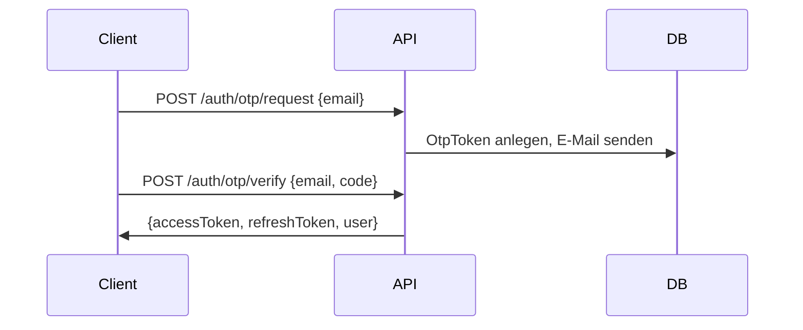

# Authentifizierung

## Token-System

| Token | Laufzeit | Speicherung |
|-------|----------|-------------|
| Access Token (JWT) | 15 Min | Stateless, Claim: `sub`, `email`, `isAdmin`, `jti` |
| Refresh Token | 90 Tage | Gehasht in `refresh_tokens` |

### Rotation

Bei `POST /auth/refresh` wird ein neuer Refresh Token ausgestellt; der alte wird invalidiert. Wiederverwendung eines revoked Tokens → gesamte Token-Family wird gesperrt.

## E-Mail OTP

## Passkey (WebAuthn)

1. `POST /auth/passkey/login/begin` – Challenge
2. Browser WebAuthn API
3. `POST /auth/passkey/login/finish` – Verifizierung → Tokens

Registrierung (eingeloggt):

1. `POST /auth/passkey/register/begin`
2. `POST /auth/passkey/register/finish`
3. `DELETE /auth/passkey/{id}`

## Discord OAuth2 + PKCE

1. `GET /auth/discord/start` – Redirect zu Discord
2. `GET /auth/discord/callback?code=&state=` – Token-Ausstellung

Neue Discord-Nutzer werden automatisch angelegt.

## Logout

`POST /auth/logout` mit `refreshToken` im Body. Optional mit Access Token im Header (blacklistet `jti`).

## JWT-Schlüssel

Produktion: RS256 mit `JWT_PRIVATE_KEY` / `JWT_PUBLIC_KEY`.

Entwicklung: HS256 mit `JWT_SECRET`.
