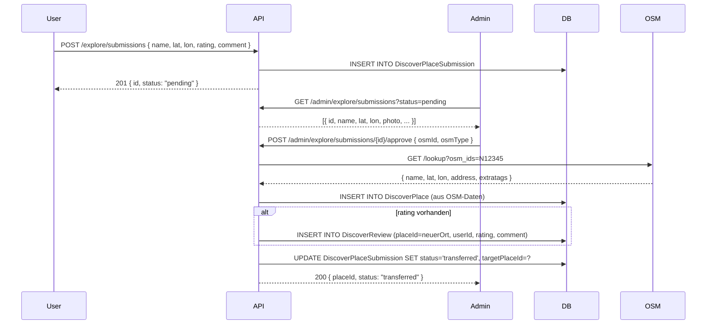

# Manuelle Ort-Einreichung (Missing Place) – Implementiert

> **Status:** Vollständig implementiert am 25.07.2026.
> Siehe `readme.md` in diesem Verzeichnis für die aktuelle Dokumentation.

## Übersicht der implementierten Komponenten

| Komponente | Datei |
|---|---|
| DB-Migration | `events/discover_place_submission_schema.sql` |
| Repository | `src/Repository/DiscoverPlaceSubmissionRepository.php` |
| Service | `src/Services/PlaceSubmissionService.php` |
| Controller (User) | `src/Controllers/PlaceSubmissionController.php` |
| Admin-Endpunkte | `src/Controllers/AdminController.php` (Methoden: submissions, submissionDetail, submissionApprove, submissionReject) |
| Admin-Template (Liste) | `templates/admin/submissions.php` |
| Admin-Template (Detail) | `templates/admin/submission_detail.php` |
| Routen | `config/routes.php` |
| Dependencies | `config/dependencies.php` |
| OpenAPI | `openapi.yaml` (Schemas + Endpunkte) |
| Dokumentation | `docs/explore/readme.md` (Abschnitt "Manuelle Ort-Einreichung")

## 2. Neue Datenbanktabelle: `DiscoverPlaceSubmission`

```sql
CREATE TABLE DiscoverPlaceSubmission (
    id          CHAR(36) PRIMARY KEY,
    userId      CHAR(36) NOT NULL,
    name        VARCHAR(255) NOT NULL,
    address     TEXT,
    latitude    DECIMAL(10,7) NOT NULL,
    longitude   DECIMAL(10,7) NOT NULL,
    photo       TEXT,
    mapLink     TEXT,
    website     TEXT,
    rating      TINYINT(1) DEFAULT NULL,
    comment     TEXT DEFAULT NULL,
    status      ENUM('pending','approved','rejected','transferred') NOT NULL DEFAULT 'pending',
    userNote    TEXT,
    adminNote   TEXT,
    targetPlaceId CHAR(36) DEFAULT NULL,
    createdAt   DATETIME NOT NULL DEFAULT NOW(),
    updatedAt   DATETIME NOT NULL DEFAULT NOW(),

    INDEX idx_status (status),
    INDEX idx_userId (userId)
);
```

## 3. API-Endpunkte

### 3.1 `POST /explore/submissions` — Ort einreichen (JWT)

Es muss sowohl strukturiert die Informationen über den neuen Ort übermittelt werden, als auch die ID des Nutzers, der diesen einsendet. Wenn die anschließende Beschreibung das nicht so tut, muss die Nutzer ID irgendwo ergänzt werden.

**Body:**
```json
{
    "name": "Mein Lieblingsrestaurant",
    "address": "Musterstraße 1, 12345 Berlin",
    "latitude": 52.5200,
    "longitude": 13.4050,
    "photo": "",
    "mapLink": "https://maps.google.com/?q=...",
    "website": "https://example.com",
    "rating": 5,
    "comment": "Super Ort!",
    "note": "Ich kann das nicht finden."
}
```

**Validierung:**
- `name`: required, string, max 255
- `latitude`/`longitude`: required, float, -90..90 / -180..180
- `photo`: optional, Base64-string
- `mapLink`, `website`: optional, URL-Validierung
- `rating`: optional, int 1–5
- `comment`: optional, string
- `note`: optional, string

**Response:** `201 { data: { id, status: "pending", ... } }`

### 3.2 `GET /explore/submissions` — Eigene Einreichungen (JWT)

Paginiert, nur eigene Submissions des authentifizierten Nutzers.

### 3.3 `GET /admin/explore/submissions` — Alle Einreichungen (Admin)

Mit optionalem Filter nach `status` (pending/approved/rejected/transferred), paginiert.

### 3.4 `POST /admin/explore/submissions/{id}/approve` — Freigeben & Transferieren (Admin)

Der Admin findet den echten OSM-Eintrag und gibt dessen Daten an:

```json
{
    "osmId": 123456789,
    "osmType": "N",
    "adminNote": "In OSM gefunden als Restaurant Beispiel"
}
```

**Ablauf:**
1. `ExploreService::createPlace()` aufrufen → Ort in `DiscoverPlace` anlegen (OSM-Daten via Nominatim)
2. Existieren `rating`/`comment` in der Submission → `DiscoverReview` für den neuen Place anlegen (verknüpft mit `userId` des Einreichers)
3. Submission-Status auf `transferred` setzen, `targetPlaceId` = neue Place-ID
4. Response: `200 { data: { placeId, status: "transferred" } }`

**Wenn der Ort noch nicht in OSM existiert:**
Kann der Admin den Ort zunächst in OSM anlegen (manuell, außerhalb dieser API) und dann mit dem Approve-Endpunkt übernehmen.

### 3.5 `POST /admin/explore/submissions/{id}/reject` — Ablehnen (Admin)

```json
{
    "reason": "Doppelter Eintrag, existiert bereits als ..."
}
```

Setzt Status auf `rejected`, speichert `adminNote`.

## 4. Bewertungs-Verknüpfung

Es wird **keine separate Review-Tabelle** für Submissions angelegt. Der Nutzer kann bei Einreichung optional `rating` (1-5) und `comment` angeben. Diese werden in `DiscoverPlaceSubmission` gespeichert und beim Transfer automatisch als `DiscoverReview` für den neuen Place übernommen (`userId` = Einreicher, `placeId` = neuer Place).

Der Nutzer kann nach dem Transfer auch weitere Bewertungen abgeben oder die bestehende bearbeiten/löschen — über den bestehenden Review-Mechanismus.

## 5. Neue Dateien / Änderungen

| Datei | Aktion |
|---|---|
| `src/Repository/DiscoverPlaceSubmissionRepository.php` | **Neu** – CRUD, Status-Filter, Admin-Queries |
| `src/Services/PlaceSubmissionService.php` | **Neu** – Einreichen, Approve (mit Transfer), Reject |
| `src/Controllers/PlaceSubmissionController.php` | **Neu** – `POST /explore/submissions`, `GET /explore/submissions` |
| `src/Controllers/AdminController.php` | **Erweitern** – Admin-Endpunkte (3.3–3.5) |
| `config/routes.php` | Neue Routen registrieren |
| `openapi.yaml` | Neue Endpunkte dokumentieren |
| `docs/explore/readme.md` | Abschnitt zu Submission ergänzen (nach Fertigstellung) |
| Admin-Dashboard | UI zur Verwaltung der Submissions |

## 6. Datenfluss (Transfer)



## 7. Offene Fragen

1. Soll der initiale `rating`/`comment` beim Einreichen Pflicht oder optional sein?
2. Darf der Nutzer nach dem Einreichen die Submission bearbeiten? (z. B. nachträglich Koordinaten korrigieren)
3. Soll es ein Soft-Delete für Submissions geben, oder reicht der Status `rejected`?
4. Wie gehen wir mit Foto-Upload um? (Aktuell nur URL geplant — Base64 oder Datei-Upload nötig?)
5. Sollen Benachrichtigungen an den Nutzer verschickt werden bei Status-Änderung (approved/rejected)?

### Antworten:

1. Ja, rating/comment beim Einreichen immer Pflicht, damit die Datenbank nicht voll ist mit unbewerteten Empfehlungen.
2. Ja, nachträgliche Korrektur möglich.
3. Beim Ablehnen von Submissions soll verknüpfte Bewertung gelöscht werden, sowie alle Informationen außer Name und Koordinaten. Status auf rejected. Könnte für Anzeige in UI in Clients praktisch sein und zum Nachvollziehen von Admins.
4. Foto-Upload auf jeden Fall via Base64, gemäß den Richtlinien zum Umgang mit Fotos im gesamten restlichen Projekt. Siehe wie es sonstwo implementiert ist und was die Docs dazu sagen.
5. Ja, Benachrichtigung bei Statusänderung. Ebenfalls Benachrichtigung an den Admin, dass ein (nicht gefundener) Ort eingereicht wurde.
