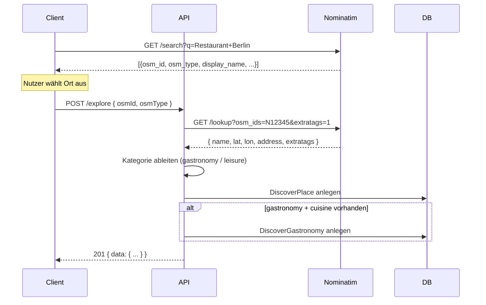

# Entdecken (Explore)

Die Explore-Funktion erlaubt Nutzern das Sammeln und Durchsuchen von Orten
der Kategorien **Gastronomie** und **Freizeit**. Die API integriert sich direkt
mit **OpenStreetMap** (Nominatim), um Ortsdaten automatisch abzurufen.

> **Hinweis zu Zeitangaben:** Alle Datum- und Zeitangaben (DateTime) werden ausschließlich in UTC gespeichert und von der API in UTC ausgegeben. Das Format ist `YYYY-MM-DD HH:MM:SS` (24h, ohne Millisekunden, ohne Zeitzonenindikatoren). Clients sind eigenständig für die Konvertierung lokaler Zeitangaben nach UTC vor dem Senden und von UTC in die lokale Zeitzone bei der Anzeige verantwortlich. Die API führt keine Zeitzonenkonvertierung durch.

## Datenbank-Tabellen

| Tabelle | Beschreibung |
|---------|-------------|
| `DiscoverPlace` | Haupttabelle mit allen Orten |
| `DiscoverGastronomy` | Zusatzdaten für Gastronomie (cuisine) |
| `DiscoverReview` | Bewertungen (für Löschberechtigung) |
| `DiscoverBookmark` | Lesezeichen (für zukünftige Nutzung) |

## Create-Flow (Ort anlegen)

Der Benutzer sucht den Ort zunächst selbstständig über den Nominatim-Dienst
(z. B. via Client-seitiger Suche). Der Client sendet dann die OSM-ID und den
OSM-Typ an die API, die daraufhin die Detaildaten von Nominatim abruft.



### Kategorie-Ableitung

Die API bestimmt die Kategorie automatisch aus den OSM-Tags:

| Kategorie | OSM-Tags |
|-----------|----------|
| **gastronomy** | `amenity=restaurant|cafe|pub|bar|fast_food|food_court|ice_cream`, `cuisine=*`, `shop=bakery|confectionery|butcher` |
| **leisure** | `leisure=*`, `tourism=*`, `historic=*`, `amenity=cinema|theatre|park|library|museum|art_gallery` |
| Fallback | `leisure` |

## Update/Refresh-Flow

Jeder authentifizierte Nutzer kann einen bestehenden Ort aktualisieren.
Die API ruft die aktuellen OSM-Daten von Nominatim ab und überschreibt
alle Felder (außer `id`, `creatorId`, `createdAt`).

```
PUT /explore/{id}
→ 200 { data: { ... } }
```

## Delete-Flow (Löschberechtigung)

Nur der **Ersteller** des Ortes darf diesen löschen – und auch nur dann,
wenn noch keine Bewertungen (Reviews) zu diesem Ort existieren.
**Administratoren** (`isAdmin = true`) dürfen jederzeit löschen.

```php
canDelete(user, creatorId, hasReviews):
  if user.isAdmin → true
  if user.id !== creatorId → false
  if hasReviews → false
  → true
```

## Suche (Search)

Die Suche unterstützt mehrere Filter gleichzeitig:

| Parameter | Typ | Beschreibung |
|-----------|-----|-------------|
| `q` | string | Volltextsuche im Namen |
| `category` | enum | `gastronomy` / `leisure` |
| `cuisine` | string | Küchen-Typ (nur Gastronomie) |
| `sort` | enum | Sortierung (`name_asc`, `name_desc`, `created_asc`, `created_desc`, `rating_asc`, `rating_desc`) |
| `city` | string | Filtert nach Stadt (LIKE-Suche in der `address`-Spalte) |
| `lat` + `lon` + `radius` | float + int | Umkreissuche in Metern |
| `location` + `radius` | string + int | Ortsname (wird geocoded) + Radius |
| `page` / `limit` | int | Paginierung |

**Umkreissuche:** Verwendet die Haversine-Formel in SQL. Die Ergebnisse
enthalten ein `distance`-Feld in Metern und sind primär nach Distanz
aufsteigend sortiert. Ein zusätzlicher `sort`-Parameter wird als sekundäres
Sortierkriterium angewandt.

**Geocoding:** Wenn `location` statt `lat`/`lon` übergeben wird, löst die
API den Ortsnamen über Nominatim in Koordinaten auf und führt dann die
Umkreissuche durch. Default-Radius: 5000m, Maximum: 50000m.

### Beispiele

```
# Alle gastronomy-Orte
GET /explore?category=gastronomy

# Gastronomie-Orte mit Küchen-Filter
GET /explore?category=gastronomy&cuisine=italian&sort=name_asc

# Umkreissuche mit Koordinaten (10km um Berlin-Mitte)
GET /explore/search?lat=52.5200&lon=13.4050&radius=10000

# Umkreissuche mit Ortsname und Sortierung
GET /explore/search?location=Berlin&radius=10000&category=leisure&sort=name_asc

# Volltextsuche nach italienischen Restaurants
GET /explore/search?q=pizza&cuisine=italian

# Stadt-Filter (alle Orte in Berlin ohne Radius)
GET /explore/search?city=Berlin

# Paginierte Liste
GET /explore?category=gastronomy&page=1&limit=20

# Suche sortiert nach Bewertung
GET /explore/search?cuisine=italian&sort=rating_desc
```

## OSM/Nominatim-Integration

### Nutzung

- **Endpunkt:** `https://nominatim.openstreetmap.org`
- **Lookup:** `/lookup?osm_ids=N12345&format=json&addressdetails=1&extratags=1`
- **Geocode:** `/search?q=Berlin&format=json&limit=1`
- **User-Agent:** `SinclearBeyondAPI/2.0 (https://sinclear.app)` (von OSM vorgeschrieben)
- **Kein Tile-Zugriff** (keine Karten-Backend-Nutzung)

### Rate-Limiting

Erzwungen durch `NominatimRateLimiter` (`src/Services/NominatimRateLimiter.php`):
- **Min. 1,1 Sekunden** zwischen zwei aufeinanderfolgenden Nominatim-Requests
- File-basierte Sperre via `flock()` in `var/cache/nominatim/ratelimit.lock`
- Gilt für **alle** PHP-Prozesse (Shared‑Lock via Dateisystem)

### Caching

Verwaltet durch `NominatimCache` (`src/Services/NominatimCache.php`):
- Nominatim-Responses werden als JSON in `var/cache/nominatim/` gespeichert
- **TTL: 24h** (86400s) – keine unnötigen Wiederholungs-Requests
- Cache-Key: `md5('lookup|N12345')` bzw. `md5('search|Berlin')`
- Schreibzugriff mit `LOCK_EX` für Race‑Condition‑Schutz

#### Cache-Bereinigung (Cron)

```cron
# Täglich um 03:00 Uhr abgelaufene Cache-Dateien löschen
0 3 * * * /usr/bin/php /pfad/zum/projekt/bin/clear-nominatim-cache.php
```

Das Skript gibt die Anzahl gelöschter Dateien aus und beendet sich mit Exit‑Code 0.
Kein Output bei leerem Cache → Cron kann stumm laufen.

**Verzeichnis-Rechte:**
- `var/cache/nominatim/`: `775` (Owner: Web-User, Gruppe: Webserver-Gruppe)
- Dateien innerhalb: `664`
- Der Cache-Ordner muss **schreibbar** durch den Web-Server-User sein
- Geschützt durch `.htaccess` (obere `.htaccess` blockiert `^var/`)

### Fehlerbehandlung bei 429 Too Many Requests

Die private Methode `nominatimRequest()` erkennt HTTP 429:
1. Wertet `Retry-After`-Header aus (fällt auf 1s zurück, falls fehlt/nicht numerisch)
2. Wartet die angegebene Zeit (`usleep`)
3. Wiederholt den Request **einmal**
4. Schlägt der zweite Versuch fehl → `RuntimeException('Nominatim rate-limited despite retry')`

### OSM-Attribution

Jede Explore-API-Response enthält das Feld `_attribution`:

```json
{
  "_attribution": "© OpenStreetMap contributors"
}
```

Clients sind verpflichtet, diesen Quellennachweis in ihrer UI anzuzeigen
(OSM-Lizenzbedingungen / Nominatim-Usage-Policy).

## API-Endpunkte

| Methode | Pfad | Auth | Beschreibung |
|---------|------|------|-------------|
| `GET` | `/explore` | JWT | Paginierte Liste (optional mit `sort`, `cuisine`) |
| `POST` | `/explore` | JWT | Neuen Ort anlegen |
| `GET` | `/explore/search` | JWT | Suche + Umkreissuche |
| `GET` | `/explore/random` | JWT | Zufällige Orte (optional nach Kategorie) |
| `GET` | `/explore/bookmarks` | JWT | Eigene Lesezeichen (paginated) |
| `GET` | `/explore/{id}` | JWT | Detailansicht |
| `PUT` | `/explore/{id}` | JWT | OSM-Refresh |
| `DELETE` | `/explore/{id}` | JWT | Löschen (policy-gesteuert) |
| `GET` | `/explore/{id}/bookmark` | JWT | Lesezeichen-Status prüfen |
| `POST` | `/explore/{id}/bookmark` | JWT | Lesezeichen setzen |
| `DELETE` | `/explore/{id}/bookmark` | JWT | Lesezeichen entfernen |
| `GET` | `/explore/{placeId}/reviews` | JWT | Bewertungen eines Ortes (paginated) |
| `POST` | `/explore/{placeId}/reviews` | JWT | Bewertung erstellen |
| `PUT` | `/explore/{placeId}/reviews/{reviewId}` | JWT | Eigene Bewertung aktualisieren |
| `DELETE` | `/explore/{placeId}/reviews/{reviewId}` | JWT | Eigene Bewertung löschen |

## Sortierung (GET /explore und GET /explore/search)

Die Liste und die Suchergebnisse können mit dem Parameter `sort` sortiert werden.
Bei der Umkreissuche in `/explore/search` wird primär nach Distanz aufsteigend
sortiert, der `sort`-Parameter dient dann als sekundäres Kriterium.

| Wert | Sortierung |
|------|-----------|
| `name_asc` | Name aufsteigend |
| `name_desc` | Name absteigend |
| `created_asc` | Erstellungsdatum aufsteigend |
| `created_desc` | Erstellungsdatum absteigend |
| `rating_asc` | Durchschnittsbewertung aufsteigend |
| `rating_desc` | Durchschnittsbewertung absteigend |

Die Durchschnittsbewertung wird automatisch aus der `DiscoverReview`-Tabelle
berechnet und als `avgRating` im Response ausgeliefert. Bei Orten ohne
Bewertungen ist `avgRating` nicht im Response enthalten.
Ohne `sort` bleibt die Standard-Sortierung (`createdAt DESC`).

### Beispiele

```
# Sortiert nach Bewertung (beste zuerst)
GET /explore?sort=rating_desc&category=gastronomy

# Zufällige Orte
GET /explore/random?limit=5

# Zufällige Gastronomie-Orte
GET /explore/random?category=gastronomy&limit=3
```

## Lesezeichen (Bookmarks)

Lesezeichen erlauben Nutzern, sich Orte zu merken. Die Tabelle
`DiscoverBookmark` speichert die Zuordnung via `(userId, placeId)` mit
einem UNIQUE-Constraint.

| Methode | Pfad | Beschreibung |
|---------|------|-------------|
| `GET` | `/explore/{id}/bookmark` | Status prüfen → `{ data: { bookmarked: true/false } }` |
| `POST` | `/explore/{id}/bookmark` | Lesezeichen setzen → `201 { data: { id, bookmarked: true } }` |
| `DELETE` | `/explore/{id}/bookmark` | Lesezeichen entfernen → `204` |
| `GET` | `/explore/bookmarks` | Alle eigenen Lesezeichen (paginated) |

Ein bereits gesetztes Lesezeichen erneut zu setzen, gibt `409 Conflict`
mit `bookmark_exists` zurück. Das Löschen eines nicht existierenden
Lesezeichens ist ein No-Op und gibt ebenfalls `204` zurück.

## Bewertungen (Reviews)

Die Bewertungs-API erlaubt das Abrufen, Erstellen, Aktualisieren und
Löschen von Bewertungen zu Entdecken-Orten. Der Ersteller einer Bewertung
sowie Administratoren dürfen eine Bewertung bearbeiten oder löschen.
Ein Nutzer kann mehrere Bewertungen zu demselben Ort abgeben.

### Endpunkte

| Methode | Pfad | Auth | Beschreibung |
|---------|------|------|-------------|
| `GET` | `/explore/{placeId}/reviews` | JWT | Alle Bewertungen zu einem Ort (paginated) |
| `POST` | `/explore/{placeId}/reviews` | JWT | Neue Bewertung erstellen |
| `PUT` | `/explore/{placeId}/reviews/{reviewId}` | JWT | Eigene Bewertung aktualisieren |
| `DELETE` | `/explore/{placeId}/reviews/{reviewId}` | JWT | Eigene Bewertung löschen |

### Parameter

| Endpunkt | Parameter | Typ | Beschreibung |
|----------|-----------|-----|-------------|
| `GET /explore/{placeId}/reviews` | `page` / `limit` | int | Paginierung |
| `POST /explore/{placeId}/reviews` | `rating` | int (1-5) | **Pflicht.** Bewertung |
| | `comment` | string | Optional. Kommentar |
| `PUT /explore/{placeId}/reviews/{reviewId}` | `rating` | int (1-5) | Optional. Bewertung |
| | `comment` | string/null | Optional. Kommentar (`null` löscht ihn) |

### Beispiele

```
# Alle Bewertungen zu einem Ort abrufen
GET /explore/550e8400-e29b-41d4-a716-446655440000/reviews

# Neue Bewertung erstellen
POST /explore/550e8400-e29b-41d4-a716-446655440000/reviews
Body: { "rating": 4, "comment": "Tolles Restaurant!" }
→ 201 { "data": { "id": "...", "rating": 4, "comment": "Tolles Restaurant!", ... } }

# Bewertung aktualisieren
PUT /explore/550e8400-e29b-41d4-a716-446655440000/reviews/660e8400-e29b-41d4-a716-446655440001
Body: { "rating": 5 }
→ 200 { "data": { ... } }

# Bewertung löschen
DELETE /explore/550e8400-e29b-41d4-a716-446655440000/reviews/660e8400-e29b-41d4-a716-446655440001
→ 204
```

### Response-Format

Einzelne Bewertung:

```json
{
  "data": {
    "id": "660e8400-e29b-41d4-a716-446655440001",
    "placeId": "550e8400-e29b-41d4-a716-446655440000",
    "userId": "770e8400-e29b-41d4-a716-446655440002",
    "rating": 4,
    "comment": "Tolles Restaurant!",
    "createdAt": "2026-06-23 12:00:00"
  }
}
```

Listen-Response (paginated):

```json
{
  "data": [ ... ],
  "meta": {
    "page": 1,
    "limit": 20,
    "total": 5,
    "totalPages": 1
  }
}
```
