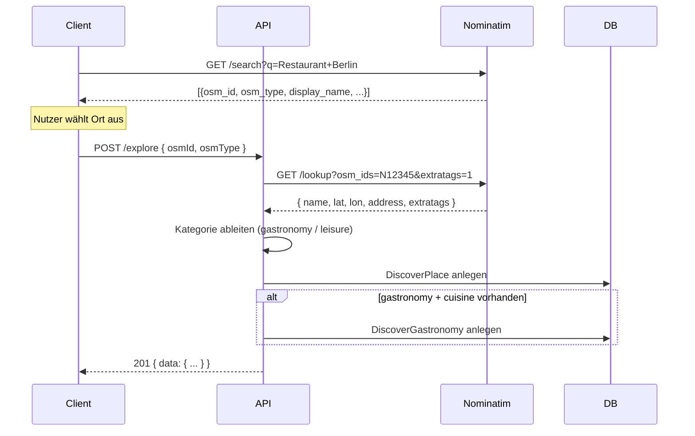

# Entdecken (Explore)

Die Explore-Funktion erlaubt Nutzern das Sammeln und Durchsuchen von Orten
der Kategorien **Gastronomie** und **Freizeit**. Die API integriert sich direkt
mit **OpenStreetMap** (Nominatim), um Ortsdaten automatisch abzurufen.

## Datenbank-Tabellen

| Tabelle | Beschreibung |
|---------|-------------|
| `DiscoverPlace` | Haupttabelle mit allen Orten |
| `DiscoverGastronomy` | Zusatzdaten für Gastronomie (cuisine) |
| `DiscoverReview` | Bewertungen (für Löschberechtigung) |
| `DiscoverBookmark` | Lesezeichen (für zukünftige Nutzung) |

## Create-Flow (Ort anlegen)

Der Benutzer sucht den Ort zunächst selbstständig über den Nominatim-Dienst
(z. B. via Client-seitiger Suche). Der Client sendet dann die OSM-ID und den
OSM-Typ an die API, die daraufhin die Detaildaten von Nominatim abruft.



### Kategorie-Ableitung

Die API bestimmt die Kategorie automatisch aus den OSM-Tags:

| Kategorie | OSM-Tags |
|-----------|----------|
| **gastronomy** | `amenity=restaurant|cafe|pub|bar|fast_food|food_court|ice_cream`, `cuisine=*`, `shop=bakery|confectionery|butcher` |
| **leisure** | `leisure=*`, `tourism=*`, `historic=*`, `amenity=cinema|theatre|park|library|museum|art_gallery` |
| Fallback | `leisure` |

## Update/Refresh-Flow

Jeder authentifizierte Nutzer kann einen bestehenden Ort aktualisieren.
Die API ruft die aktuellen OSM-Daten von Nominatim ab und überschreibt
alle Felder (außer `id`, `creatorId`, `createdAt`).

```
PUT /explore/{id}
→ 200 { data: { ... } }
```

## Delete-Flow (Löschberechtigung)

Nur der **Ersteller** des Ortes darf diesen löschen – und auch nur dann,
wenn noch keine Bewertungen (Reviews) zu diesem Ort existieren.
**Administratoren** (`isAdmin = true`) dürfen jederzeit löschen.

```php
canDelete(user, creatorId, hasReviews):
  if user.isAdmin → true
  if user.id !== creatorId → false
  if hasReviews → false
  → true
```

## Suche (Search)

Die Suche unterstützt mehrere Filter gleichzeitig:

| Parameter | Typ | Beschreibung |
|-----------|-----|-------------|
| `q` | string | Volltextsuche im Namen |
| `category` | enum | `gastronomy` / `leisure` |
| `cuisine` | string | Küchen-Typ (nur Gastronomie) |
| `lat` + `lon` + `radius` | float + int | Umkreissuche in Metern |
| `location` + `radius` | string + int | Ortsname (wird geocoded) + Radius |
| `page` / `limit` | int | Paginierung |

**Umkreissuche:** Verwendet die Haversine-Formel in SQL. Die Ergebnisse
enthalten ein `distance`-Feld in Metern und sind aufsteigend sortiert.

**Geocoding:** Wenn `location` statt `lat`/`lon` übergeben wird, löst die
API den Ortsnamen über Nominatim in Koordinaten auf und führt dann die
Umkreissuche durch. Default-Radius: 5000m, Maximum: 50000m.

### Beispiele

```
# Alle gastronomy-Orte
GET /explore?category=gastronomy

# Umkreissuche mit Koordinaten (10km um Berlin-Mitte)
GET /explore/search?lat=52.5200&lon=13.4050&radius=10000

# Umkreissuche mit Ortsname
GET /explore/search?location=Berlin&radius=10000&category=leisure

# Volltextsuche nach italienischen Restaurants
GET /explore/search?q=pizza&cuisine=italian

# Paginierte Liste
GET /explore?category=gastronomy&page=1&limit=20
```

## OSM/Nominatim-Integration

- **Endpunkt:** `https://nominatim.openstreetmap.org`
- **Lookup:** `/lookup?osm_ids=N12345&format=json&addressdetails=1&extratags=1`
- **Geocode:** `/search?q=Berlin&format=json&limit=1`
- **User-Agent:** `SinclearBeyondAPI/2.0 (https://sinclear.app)` (wird von OSM verlangt)
- **Rate-Limit:** Max. 1 Request pro Sekunde (Nominatim-Usage-Policy)

## API-Endpunkte

| Methode | Pfad | Auth | Beschreibung |
|---------|------|------|-------------|
| `GET` | `/explore` | JWT | Paginierte Liste (optional mit `sort`) |
| `POST` | `/explore` | JWT | Neuen Ort anlegen |
| `GET` | `/explore/search` | JWT | Suche + Umkreissuche |
| `GET` | `/explore/random` | JWT | Zufällige Orte (optional nach Kategorie) |
| `GET` | `/explore/bookmarks` | JWT | Eigene Lesezeichen (paginated) |
| `GET` | `/explore/{id}` | JWT | Detailansicht |
| `PUT` | `/explore/{id}` | JWT | OSM-Refresh |
| `DELETE` | `/explore/{id}` | JWT | Löschen (policy-gesteuert) |
| `GET` | `/explore/{id}/bookmark` | JWT | Lesezeichen-Status prüfen |
| `POST` | `/explore/{id}/bookmark` | JWT | Lesezeichen setzen |
| `DELETE` | `/explore/{id}/bookmark` | JWT | Lesezeichen entfernen |

## Sortierung (GET /explore)

Die Liste kann mit dem Parameter `sort` sortiert werden:

| Wert | Sortierung |
|------|-----------|
| `name_asc` | Name aufsteigend |
| `name_desc` | Name absteigend |
| `created_asc` | Erstellungsdatum aufsteigend |
| `created_desc` | Erstellungsdatum absteigend |
| `rating_asc` | Durchschnittsbewertung aufsteigend |
| `rating_desc` | Durchschnittsbewertung absteigend |

Bei Sortierung nach Rating wird die Durchschnittsbewertung aus der
`DiscoverReview`-Tabelle berechnet und als `avgRating` im Response
ausgeliefert. Ohne `sort` bleibt die Standard-Sortierung (`createdAt DESC`).

### Beispiele

```
# Sortiert nach Bewertung (beste zuerst)
GET /explore?sort=rating_desc&category=gastronomy

# Zufällige Orte
GET /explore/random?limit=5

# Zufällige Gastronomie-Orte
GET /explore/random?category=gastronomy&limit=3
```

## Lesezeichen (Bookmarks)

Lesezeichen erlauben Nutzern, sich Orte zu merken. Die Tabelle
`DiscoverBookmark` speichert die Zuordnung via `(userId, placeId)` mit
einem UNIQUE-Constraint.

| Methode | Pfad | Beschreibung |
|---------|------|-------------|
| `GET` | `/explore/{id}/bookmark` | Status prüfen → `{ data: { bookmarked: true/false } }` |
| `POST` | `/explore/{id}/bookmark` | Lesezeichen setzen → `201 { data: { id, bookmarked: true } }` |
| `DELETE` | `/explore/{id}/bookmark` | Lesezeichen entfernen → `204` |
| `GET` | `/explore/bookmarks` | Alle eigenen Lesezeichen (paginated) |

Ein bereits gesetztes Lesezeichen erneut zu setzen, gibt `409 Conflict`
mit `bookmark_exists` zurück. Das Löschen eines nicht existierenden
Lesezeichens ist ein No-Op und gibt ebenfalls `204` zurück.
